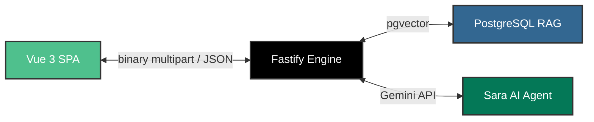

# 🟢 GATES-CARE Helpdesk

<div align="center">


[](https://vuejs.org/)
[](https://vitejs.dev/)
[](https://tailwindcss.com/)
[](https://developer.mozilla.org/en-US/docs/Web/JavaScript)

**GATES-CARE** is a state-of-the-art, AI-powered customer helpdesk designed for **GATES Technology** (Egypt's premier computer and peripherals retailer). Built with premium glassmorphic interfaces, `requestAnimationFrame`-driven animations, and a native Arabic-first RAG chat with **Sara**, our virtual AI assistant.

[🚀 Quick Start](#-run-locally) • [🛠️ Tech Stack](#%EF%B8%8F-tech-stack--design-system) • [📂 Project Architecture](#-project-architecture) • [🗺️ Route Registry](#%EF%B8%8F-route-registry) • [🎨 Feature Showcase](#-interactive-features-showcase) • [📈 Roadmap](#-milestones--roadmap)

</div>

---

## ⚡ Run Locally

Get the development server running in under a minute:

```bash
# Clone the repository and install dependencies
npm install

# Start the Vite development server
npm run dev
```

🌐 The application will open immediately at **[http://localhost:5173/](http://localhost:5173/)**

---

## 🛠️ Tech Stack & Design System

Our frontend SPA (Phase 1) is engineered for visual excellence, performance, and accessibility.

### Frontend SPA (Phase 1)
*   **Core Engine:** `Vue 3` utilizing the highly efficient `<script setup>` syntax.
*   **Routing:** `Vue Router 4` for sleek, layout-driven transitions.
*   **State:** Minimal `Pinia` integration (scalable as cross-component state is introduced).
*   **Styles:** `Tailwind CSS v4` featuring customized theme tokens.
*   **Typography:**
    *   **UI/Shell:** `Inter` (optimal legibility for dashboards and data tables).
    *   **Arabic/Sara:** `Almarai` (customized brand font optimized for RTL).
*   **Iconography:** `lucide-vue-next` for razor-sharp SVG graphics.

### Planned Backend (Phase 2)

*   **Backend Server:** `Node.js` + `Fastify` for low-latency routing and high throughput.
*   **Hosting:** AWS `t3.small` instance.
*   **Database & RAG:** `pgvector` on Postgres for hybrid semantic + keyword FAQ searching.
*   **AI Integration:** Pluggable `aiClient.js` default-powered by **Gemini API** for lightning-fast transcriptions and chat sessions.

---

## 📂 Project Architecture

```text
gates-helpdesk/
├── 📂 public/assets/             # High-quality brand assets
│   ├── 🖼️ gates-logo.png          # Transparent primary logo
│   └── 🖼️ trust-every-bit.png     # Brand assurance badge
├── 📂 src/
│   ├── 📂 layouts/               # High-level route wrappers
│   │   ├── 🖥️ PreAuthLayout.vue   # Wrapper for public pages (/, /why-gates, /contact)
│   │   └── 🖥️ AppShellLayout.vue  # Post-auth dashboard: Collapsible Sidebar + Topbar + Sara Rail
│   ├── 📂 views/                 # Top-level view containers
│   │   ├── 📄 PreLoginView.vue   # Interactive two-phase intro & tilt-plate login landing
│   │   ├── 📄 WhyGatesView.vue   # Brand pillars and benefits showcase
│   │   └── 📄 ContactView.vue    # Support channels and contact forms
│   ├── 📂 components/            # Reusable UI widgets
│   │   └── 💎 AuthModal.vue      # 5-state glassmorphic authentication morphing modal
│   ├── 📂 composables/           # Shared reactives
│   │   └── ⚡ useTilt.js         # Custom requestAnimationFrame 3D cursor tilt controller
│   ├── 📂 router/
│   │   └── 🌐 index.js           # Dynamic layout and routing engine
│   └── 🎨 style.css              # Custom Tailwind directives & global font definitions
```

---

## 🗺️ Route Registry

Our routing is layout-driven, keeping authentication pages decoupled from dashboard shells:

| Route Path | Associated Layout | Destination View | Status |
| :--- | :--- | :--- | :--- |
| `/` | `PreAuthLayout` | `PreLoginView` | 🟢 Production Ready |
| `/why-gates` | `PreAuthLayout` | `WhyGatesView` | 🟡 Template Stub |
| `/contact` | `PreAuthLayout` | `ContactView` | 🟡 Template Stub |
| `/app/*` | `AppShellLayout` | Dashboard Subviews (Inbox, Tickets, Loyalty...) | 🔵 Active Phase 1 |

---

## 🎨 Interactive Features Showcase

### 1. Pre-login Page & Intro Animation (Phase 0 — Complete)
*   **Phase 1 Intro:** A retro terminal typing effect drawing a green container, typing "GATES TECHNOLOGY" / "AT YOUR SERVICE" with a simulated real-time backspace and typo-correction effect.
*   **Phase 2 Experience:** A clean, modern login hub with the GATES logo sporting a glowing shine overlay.
*   **Micro-Animations:** A high-performance 3D mouse parallax hover effect driven by `requestAnimationFrame` lerping (plate leans ±3.5°, logo leans ±6° toward the user's cursor).

### 2. Glassmorphic Auth Modal (Complete)
A morphing, frosted-glass overlay that shifts smoothly through **5 distinct authentication states**:
1.  **Login:** Phone/Email identifier and password fields.
2.  **Register:** Comprehensive onboarding (Full Name, WhatsApp number, secondary phone, Egyptian cities registry).
3.  **Forgot Password:** OTP verification with a built-in 60s resend timer.
4.  **Reset Password:** Dynamic validation checking (min 8 characters).
5.  **Welcome Panel:** Language toggle (Arabic default) directing directly into `/app`.

> [!NOTE]
> Fully calibrated for Egyptian mobile phone structures: matches `010 / 011 / 012 / 015` with automated prefix normalization (`+20` / `0020`).

### 3. Responsive App Shell & Dashboard (Phase 1 — In Progress)
*   **Dynamic Topbar:** Integrated global search, Quick Profile, and an animated Sign Out modal.
*   **Responsive Left Sidebar:** Collapses into icons-only on standard viewport boundaries (< 1100px) and smoothly slides out of view on mobile screens (< 768px).
*   **Sara Chat Rail:** Always-docked 480px Arabic AI assistant panel supporting custom card payloads (product carousels, spec comparison grids, voice transcripts).

---

## 📈 Milestones & Roadmap

```mermaid
gantt
    title GATES-CARE Project Roadmap
    dateFormat  YYYY-MM-DD
    section Phase 0
    Pre-Login Experience & Tilt Plates   :done,    p0, 2026-05-01, 2026-05-05
    5-State Morphing Glass AuthModal    :done,    p1, 2026-05-05, 2026-05-10
    section Phase 1
    Responsive App Shell & Navigation    :active,  p2, 2026-05-10, 2026-05-20
    Sara Chat Panel UI & Local Mockups   :active,  p3, 2026-05-15, 2026-05-25
    section Phase 2
    Fastify Server & pgvector RAG DB     :todo,    p4, 2026-06-01, 2026-06-15
    Gemini API Integration & Live Chat   :todo,    p5, 2026-06-15, 2026-06-30
```

- [x] **Phase 0:** Front Gate Landing, Lerp Parallax Composables, and Authentication.
- [ ] **Phase 1:** Dashboard views implementation (Loyalty tracking, FAQs, Product Catalog, Tickets).
- [ ] **Phase 2:** Cloud database, pgvector FAQ indexing, WhatsApp notification webhooks, and live AI integration.

---

## 💡 Pending Design Decisions

The following architectural and design elements are under review for Phase 1:
- [ ] Render asset logo for collapsed sidebar state (SVG format).
- [ ] Finalize content copy for the "Why Gates?" and "Contact Us" sub-views.
- [ ] Select/Generate a professional avatar for **Sara** (our AI Agent).
- [ ] Establish brand-wide Emerald Green HEX standard (aligning `#4CAF50` and `#166534`).
- [ ] Hook up direct WhatsApp notification workflows.
- [ ] Concept validation for the dark-mode English Admin dashboard.

---

<div align="center">
GATES Technology • Trust Every Bit
</div>
